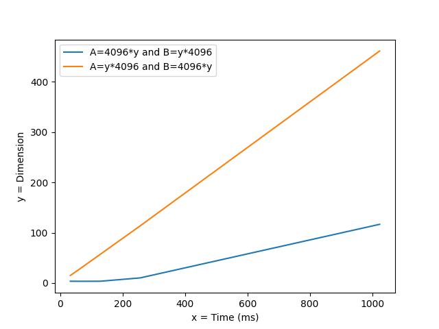

# Report For 17/12


Using examples discussed during the last week lab, please do the following:
- for the clock sample perform detailed analysis of the timeReduction kernel
- play with the data sizes and the processing grid layouts to check if the output is sensitive
- describe what clock() function does, can we measure something useful using the output of the function
- for the second algorithm (matrix multiplication) perform similar steps, but this time check using the signal mechanism of the cuda framework
- describe the basic features of this way of measuring time - what are the major differences?
- try to test different scenarios (data sizes for instance) and check the time performance
- make appropriate plots (for instance time elapsed as a function of matrix size, etc)


#### 1. for the clock sample perform detailed analysis of the timeReduction kernel

  Here is the declaration of a shared array between all the threads of a block, it is going to be useful during the rest of the kernel.

```c
  // __shared__ float shared[2 * blockDim.x];
  extern __shared__ float shared[];
```

This array will be used to retrieve all the values.
```c   
 shared[tid] = input[tid];
 shared[tid + blockDim.x] = input[tid + blockDim.x];
```

This for iterate is used to create the "round" of the reduction performance. ``__syncthreads();`` will be used so that all threads are waiting for the other.

the loop is performing so the tread will handle a number of comparison proportional of the power of 2 so for 1 it will do 8 comparaison (256 = 2^8).

| value tid | d |
-----|---------
|1|256|
|1|128|
|1|64|
|1|32|
|1|16|
|1|8|
|1|4|
|1|2|
|1|1|

So 8 comparison

when 1<1 it won't go to the loop and goes to the thread 2

| value tid | d |
-----|---------
|2|256|
|2|128|
|2|64|
|2|32|
|2|16|
|2|8|
|2|4|
|2|2|

So 7 comparison etc etc ...

```c   
// Perform reduction to find minimum.
for (int d = blockDim.x; d > 0; d /= 2)
{
    __syncthreads();

    if (tid < d)
    {
        float f0 = shared[tid];
        float f1 = shared[tid + d];

        if (f1 < f0)
        {
            shared[tid] = f1;
        }
    }
}
```


After going through every round of comparison all the results are stored in output (the same one) and the timer will be used to compute the average of time execution.

```c   
// Write result.
if (tid == 0) output[bid] = shared[0];

__syncthreads();

if (tid == 0) timer[bid+gridDim.x] = clock();
```

Finally the average

```c
clock_t minStart = timer[0];
clock_t maxEnd = timer[NUM_BLOCKS];

for (int i = 1; i < NUM_BLOCKS; i++)
{
    minStart = timer[i] < minStart ? timer[i] : minStart;
    maxEnd = timer[NUM_BLOCKS+i] > maxEnd ? timer[NUM_BLOCKS+i] : maxEnd;
}

printf("Average clocks = %Lf\n", (long double)(maxEnd - minStart));
```
#### 2. play with the data sizes and the processing grid layouts to check if the output is sensitive

I don't think that change the numbers of blocks is relevant

|blocks|threads|clocks|
--------|-----|-------|
|32|256|20500
64|128|18600
64|32|14700
64|8|10500
64|1|5042

the output seem to be sensitive

#### 3. describe what clock() function does, can we measure something useful using the output of the function

According to the Nvidia documentation :

  >when executed in device code, returns the value of a per-multiprocessor counter that is incremented every clock cycleSampling this counter at the beginning and at the end of a kernel, taking the difference of the two samples, and recording the result per thread provides a measure for each thread of the number of clock cycles taken by the device to completely execute the thread, but not of the number of clock cycles the device actually spent executing thread instructions. The former number is greater than the latter since threads are time sliced.

Yes, i think that we can mesure something useful because :

```c  
// Write result.
if (tid == 0) timer[bid+gridDim.x] = clock();
```


```c  
if (tid == 0) timer[bid] = clock();
```

So it's the thread where the clock is initialize and ended. because of that the clock function is sure to get the time of execution of all the threads.

###  For the second algorithm (matrix multiplication) perform similar steps, but this time check using the signal mechanism of the cuda framework :

#### 4. describe the basic features of this way of measuring time - what are the major differences?

```c
checkCudaErrors(cudaStreamSynchronize(stream));

// Record the start event
checkCudaErrors(cudaEventRecord(start, stream));

// Execute the kernel
int nIter = 300;

for (int j = 0; j < nIter; j++) {
    [...]
}

// Record the stop event
checkCudaErrors(cudaEventRecord(stop, stream));

// Wait for the stop event to complete
checkCudaErrors(cudaEventSynchronize(stop));

float msecTotal = 0.0f;
checkCudaErrors(cudaEventElapsedTime(&msecTotal, start, stop));
```

Here the program is using events to measure time, it does so using Events (start,stop). The difference are that first it is not executed in a kernel so it is executing not on the GPU. Moreover i think that recording the time using events and not a single clock bring many differencies.

#### 5. try to test different scenarios (data sizes for instance) and check the time performance


with A =32,32 and B = 64,32

Performance = 3.23 Gflop/s, Time = 0.041 msec

with  A = 128,32 and B = 32,128

Performance = 1.71 Gflop/s, Time = 0.153 msec

with A = 32,32 and B 2048,32

Performance = 35.13 Gflop/s, Time = 0.119 msec

with A = 2048,32 and B = 32,2048

Performance = 2.32 Gflop/s, Time = 1.804 msec

with A = 32,2048 and B = 2048,32

Performance = 73.22 Gflop/s, Time = 3.666 msec

with A = 2048,128 B = 128,2048

Performance = 34.96 Gflop/s, Time = 1.867 msec

with A = 4096,128 B = 128,4096

Performance = 38.11 Gflop/s, Time = 3.522 msec

with A = 128,4096 B = 4096,128

Performance = 75.32 Gflop/s, Time = 57.019 msec

with A = 64,4096 B = 4096,64

Performance = 74.5 Gflop/s, Time = 28.78 msec

with A = 32,4096 B = 4096,32

Performance = 72 Gflop/s, Time = 14.9 msec

with A = 4096,128 B = 128,4096

Performance = 38.35 Gflop/s, Time = 3.500 msec

with A = 4096,64 B = 64,4096

Performance = 9.68 Gflop/s, Time = 3.465 msec

with A = 4096,256 B = 256,4096

Performance = 52.82 Gflop/s, Time = 10.165 msec

with A = 4096,160 B = 160,4096

Performance = 56.55 Gflop/s, Time = 3.582 msec


With all these data sample we can say that for the multiplication of a matrix the algorithm is doing better when the matrix is thiner. Also when fixing the width of A and the height of B the time seems to respect a linear function.


