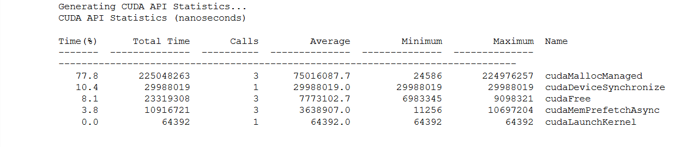
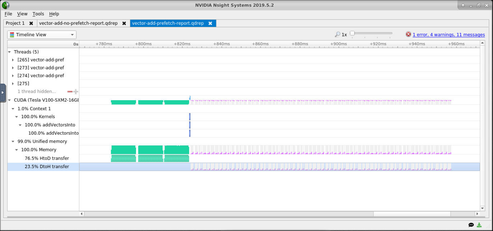
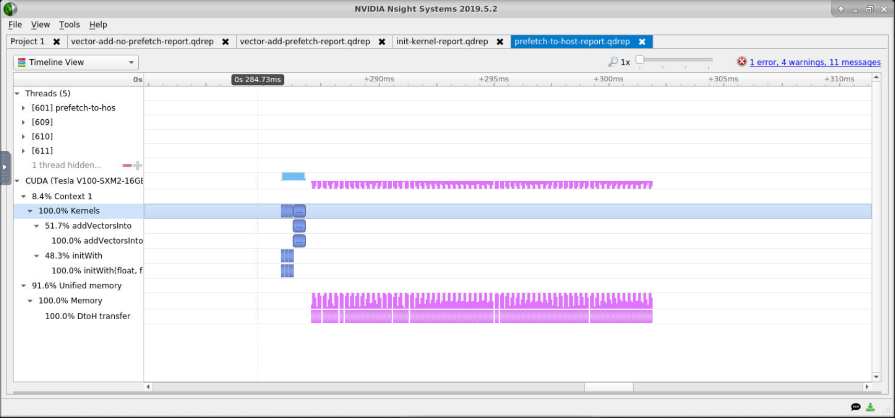

### Exercise: Compare the Timelines of Prefetching vs. Non-Prefetching

Open the report in Nsight Systems, leaving the previous report open for comparison.

- How does the execution time compare to that of the `addVectorsInto` kernel prior to adding asynchronous prefetching?
- Locate `cudaMemPrefetchAsync` in the *CUDA API* section of the timeline.
- How have the memory transfers changed?

#### How does the execution time compare to that of the `addVectorsInto`

After executing both programs we see that for `vector-add-no-prefetch`  the execution time is

`Time(%)      Total Time   Instances         Average         Minimum         Maximum  Name`

`100.0       104372788           1     104372788.0       104372788       104372788  addVectorsInto `

And for `vector-add-prefetch-solution` the execution time is

`Time(%)      Total Time   Instances         Average         Minimum         Maximum                                              Name`

`     100.0          506113           1        506113.0          506113             506113     addVectorsInto `

#### Locate `cudaMemPrefetchAsync` in the *CUDA API* section of the timeline.

#### How have the memory transfers changed ?

The Memory transfers took way less time when the vectors where prefetch before we see in the CUDA API timeline that even if it add a function. Also i see that there is a bit more of DToH transfers

         

### Exercise: Profile Refactor with Launch Init in Kernel

Open the new report file in Nsight Systems and do the following:

- Compare the application and `addVectorsInto` runtimes to the previous version of the application, how did they change?
- Look at the *Kernels* section of the timeline. Which of the two kernels (`addVectorsInto` and the initialization kernel) is taking up the majority of the time on the GPU?
- Which of the following does your application contain?
  - Data Migration (HtoD)
  - Data Migration (DtoH)

#### Compare the application and `addVectorsInto` runtimes to the previous version of the application, how did they change?

The runtimes of `addVectorsInto` decrease a little. It went from `506113` to `501402`

  `Time(%)      Total Time   Instances         Average         Minimum         Maximum                                              Name`

  `     51.5          501042           1        501042.0          501042          501042  addVectorsInto  `

#### Look at the *Kernels* section of the timeline. Which of the two kernels (`addVectorsInto` and the initialization kernel) is taking up the majority of the time on the GPU

It's `AddVectorsInto` which take the majority of the time

we see that `addVectorsInto` is taking 51.5% of the time and `initWith` only 48.5%

#### Which of the following does your application contain?

The application contain 100% of **DtoH** transfers

### Exercise: Profile Refactor with Asynchronous Prefetch Back to the Host

Open this report file in Nsight Systems, and do the following:

- Use the *Unified Memory* section of the timeline to compare and contrast the *Data Migration (DtoH)* events before and after adding prefetching back to the CPU.

We see that there is no more Host to Device transfers which is because we initialize the vectors directly on the GPU.

Also

Operation Time without Init but with Prefetch:

Operation Time with Init and with Prefetch:

We can see that the running times gain is huge because before initializing vectors directly on the GPU Host to Device running time was 76.5% of the total time which is almost 40 milliseconds.

And after all the optimization the total time of operations is now 10 milliseconds.
